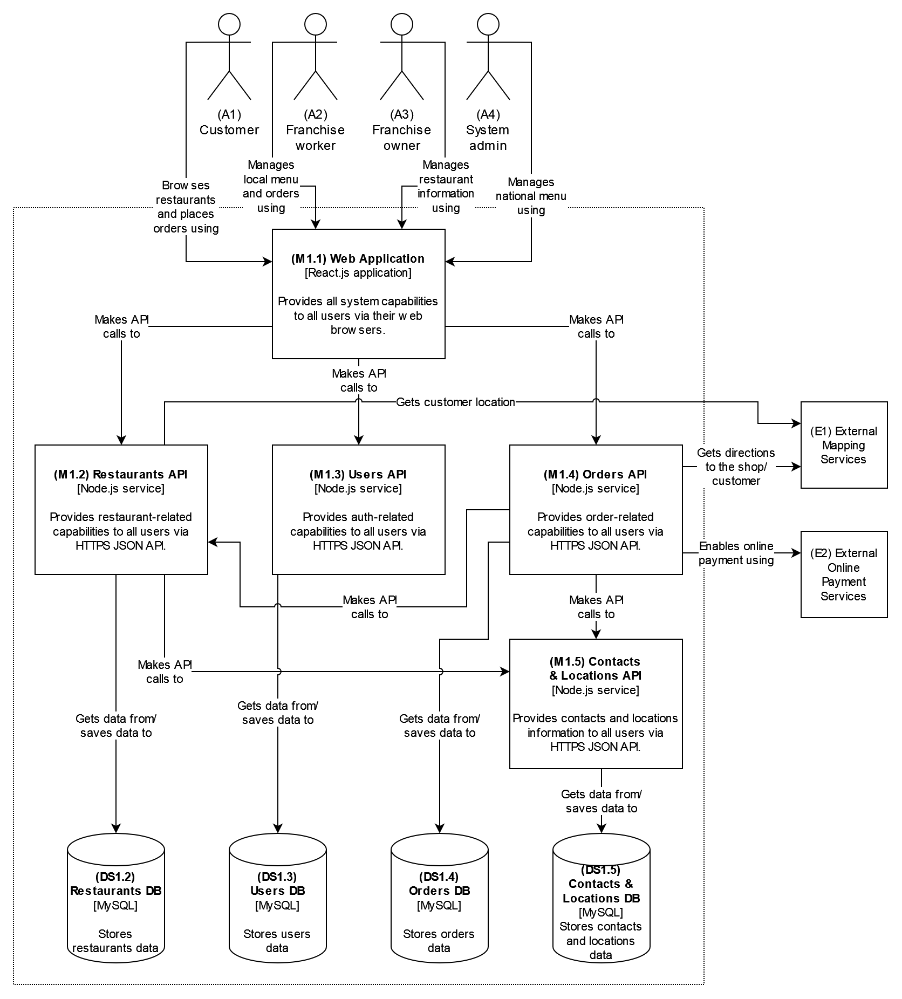
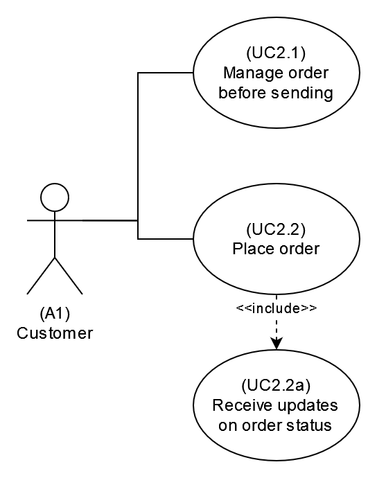

# National Sandwich Shop Online Ordering System
This document describes architecture design for National Sandwich Shop Online Ordering System

Author: Jakub Sowiński

Status: In progress

Last updated: 30-05-2022

## Context
A national sandwich shop wants to enable 'fax in your order' but over the Internet instead (in addition to their current fax-in service)

- Users: thousands, perhaps one day millions
- Requirements:
    - users will place their order, then be given a time to pick up their sandwich and directions to the shop (which must integrate with several external mapping services that include traffic information)
    - if the shop offers a delivery service, dispatch the driver with the sandwich to the user
    - mobile-device accessibility
    - offer national daily promotionals/specials
    - offer local daily promotionals/specials
    - accept payment online or in person/on delivery
- Additional Context:
    - Sandwich shops are franchised, each with a different owner.
    - Parent company has near-future plans to expand overseas.
    - Corporate goal is to hire inexpensive labor to maximize profit.

## Architectural drivers

### High-level functional requirements

#### Actors
Actors described below will be further referred to as (A1), (A2), (A3), etc.

| Name | Code | Description |
| --- | --- | --- |
| Customer | A1 | Sandwich shop customer, who can browse restaurants and order a sandwich from selected restaurant. |
| Franchise worker | A2 | Restaurant worker, who can offer local daily promotions/specials, and accept or decline (A1) orders. |
| Franchise owner | A3 | Restaurant owner, who can manage restaurant information in the system, and perform other tasks of (A2). |
| System admin | A4 | System administrator, who can offer national daily promotions/specials. |

#### Requirements
Requirements described below will be further referred to as (R1.1), (R1.3.2), (R2.1), etc.

1. As a Customer (A1), I want to be able to:
    1. Browse existing restaurants.
    2. Order from selected restaurant.
    3. Pay for my order online.
    4. Receive my order:
        1. Personally, in restaurant.
        2. Delivered to my location, if restaurant offers delivery service.
2. As a Franchise worker (A2), I want to be able to:
    1. Authenticate with the system.
    2. Receive Customer's (A1) order, if it was placed in my restaurant.
    3. Accept or decline Customer's (A1) order.
    4. Offer local daily promotions/specials.
3. As a Franchise owner (A3), I want to be able to:
    1. Perform the same tasks Franchise worker (A2) can.
    2. Manage information related to my restaurant in the system.
4. As a System admin (A4), I want to be able to:
    1. Perform the same tasks Franchise owner (A3) can for all the restaurants in the system.
    2. Offer national daily promotions/specials.

### Business limitations
Business limitations described below will be further referred to as (BL1), (BL2), (BL3), etc.

### Technical limitations
Technical limitations described below will be further referred to as (TL1), (TL2), (TL3), etc.

### Characteristics
Characteristics described below will be further referred to as (C1), (C2), (C3), etc.

## System (C1)

### System diagram
Systems included In this diagram will be further referred to as (S1), (S2), (S3), etc.

### Use cases
Use cases included In this diagram will be further referred to as (UC1), (UC2), (UC3), etc.

### Conceptual data model

## Containers (C2)

### Container diagram
Modules included in this diagram will be further referred to as (M1.1), (M1.2), (M1.3), etc.

Data stores included in this diagram will be further referred to as (DS1.1), (DS1.2), (DS1.3), etc.

### Use cases

#### (UC1) Customer browses restaurants

##### Use case diagram

##### (UC1.1) Customer searches for restaurant

###### Sequence diagram

#### (UC2) Customer orders

##### (UC2.2) Customer places order

###### Sequence diagram

## Components (C3)

### Component diagram

### Entity-relationship data model

#### (DS1.2) Restaurants DB

##### RESTAURANTS
| PK | FK | Name | Type |
| --- | --- | --- | --- |
| ✓ | | Id | Uuid |
| | ✓ | LocationId | Uuid |
| | ✓ | ContactId | Uuid |
| | ✓ | MenuId | Uuid |
| | | Name | varchar(255) |
| | | Description | varchar(4096) |
| | | Delivery | bit |

##### MENUS
| PK | FK | Name | Type |
| --- | --- | --- | --- |
| ✓ | | Id | Uuid |
| | | Name | varchar(255) |
| | | Description | varchar(4096) |

##### MENU_ITEMS
| PK | FK | Name | Type |
| --- | --- | --- | --- |
| ✓ | | Id | Uuid |
| | | Name | varchar(255) |
| | | Description | varchar(4096) |
| | | Type | char(1) |
| | | Price | integer(8) |

##### MENU_ITEMS_TO_MENUS
| PK | FK | Name | Type |
| --- | --- | --- | --- |
| ✓ | | Id | Uuid |
| | ✓ | MenuId | Uuid |
| | ✓ | MenuItemId | Uuid |

##### PROMOTIONS
| PK | FK | Name | Type |
| --- | --- | --- | --- |
| ✓ | | Id | Uuid |
| | | Name | varchar(255) |
| | | Description | varchar(4096) |

##### PROMOTIONS_TO_MENU_ITEMS
| PK | FK | Name | Type |
| --- | --- | --- | --- |
| ✓ | | Id | Uuid |
| | ✓ | PromotionId | Uuid |
| | ✓ | MenuItemId | Uuid |
| | | NewPrice | integer(8) |

##### PROMOTIONS_TO_RESTAURANTS
| PK | FK | Name | Type |
| --- | --- | --- | --- |
| ✓ | | Id | Uuid |
| | ✓ | PromotionId | Uuid |
| | ✓ | RestaurantId | Uuid |

#### (DS1.3) Users DB

##### USERS
| PK | FK | Name | Type |
| --- | --- | --- | --- |
| ✓ | | Id | Uuid |
| | ✓ | RoleId | Uuid |
| | | Username | varchar(255) |
| | | Password | varchar(255) |

##### ROLES
| PK | FK | Name | Type |
| --- | --- | --- | --- |
| ✓ | | Id | Uuid |
| | | Name | varchar(255) |
| | | Description | varchar(4096) |
| | | AccessLevel | integer(10) |

##### USER_ACTIONS_LOG
| PK | FK | Name | Type |
| --- | --- | --- | --- |
| ✓ | | Id | Uuid |
| | ✓ | UserId | Uuid |
| | | Action | varchar(255) |
| | | Timestamp | timestamp |

#### (DS1.4) Orders DB

##### ORDERS
| PK | FK | Name | Type |
| --- | --- | --- | --- |
| ✓ | | Id | Uuid |
| | ✓ | LocationId | Uuid |
| | ✓ | ContactId | Uuid |
| | | Comment | varchar(255) |
| | | Price | integer(10) |
| | | PaymentType | char(1) |

##### MENU_ITEMS_TO_ORDERS
| PK | FK | Name | Type |
| --- | --- | --- | --- |
| ✓ | | Id | Uuid |
| | ✓ | OrderId | Uuid |
| | ✓ | MenuItemId | Uuid |
| | ✓ | PromotionId | Uuid |

##### ORDERS_UPDATES
| PK | FK | Name | Type |
| --- | --- | --- | --- |
| ✓ | | Id | Uuid |
| | ✓ | OrderId | Uuid |
| | | Status | char(1) |
| | | Comment | varchar(255) |
| | | Timestamp | timestamp |

#### (DS1.5) Contacts & Locations DB

##### LOCATIONS
| PK | FK | Name | Type |
| --- | --- | --- | --- |
| ✓ | | Id | Uuid |
| | | CountryCode | char(3) |
| | | CurrencyCode | char(3) |
| | | Region | varchar(255) |
| | | City | varchar(255) |
| | | Street | varchar(255) |
| | | StreetNumber | varchar(255) |
| | | PostalCode | numeric(6) |
| | | Coordinates | varchar(64) |

##### CONTACTS
| PK | FK | Name | Type |
| --- | --- | --- | --- |
| ✓ | | Id | Uuid |
| | | FirstName | varchar(255) |
| | | LastName | varchar(255) |
| | | PhoneNumber | numeric(12) |
| | | EmailAddress | varchar(255) |

## Decisions

### (ADR1) Decision to treat "specials" as menu items of different type

### (ADR2) Decision to separate APIs and DSs into Restaurants, Users, Orders, and Contacts & Locations