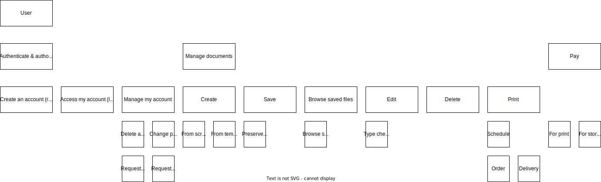
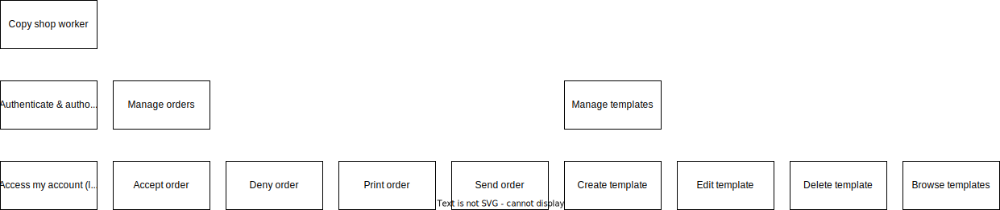
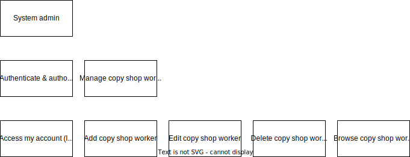
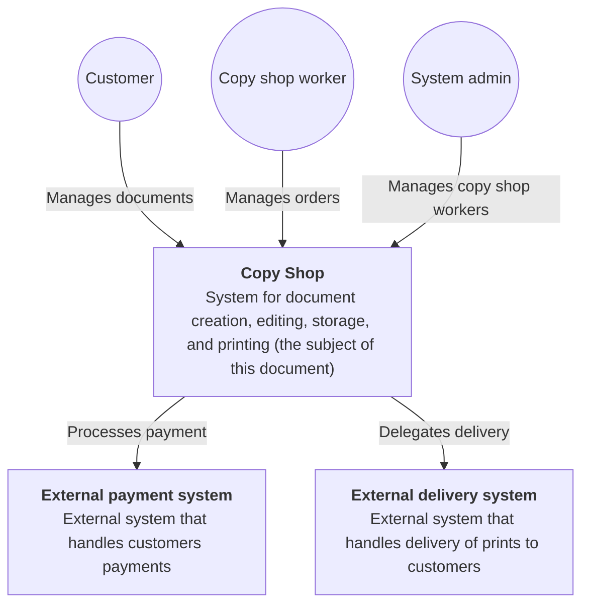
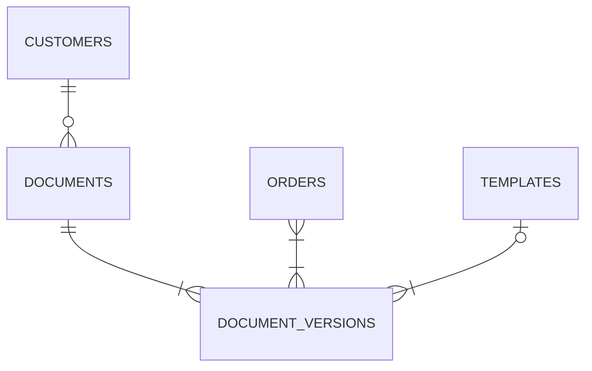
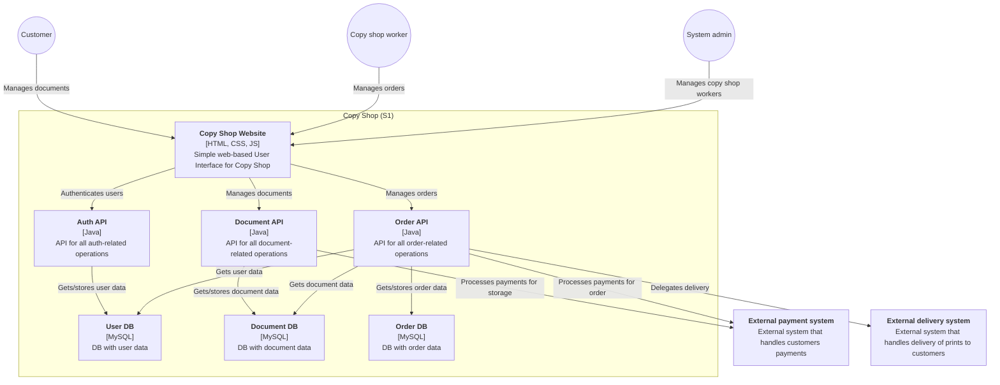
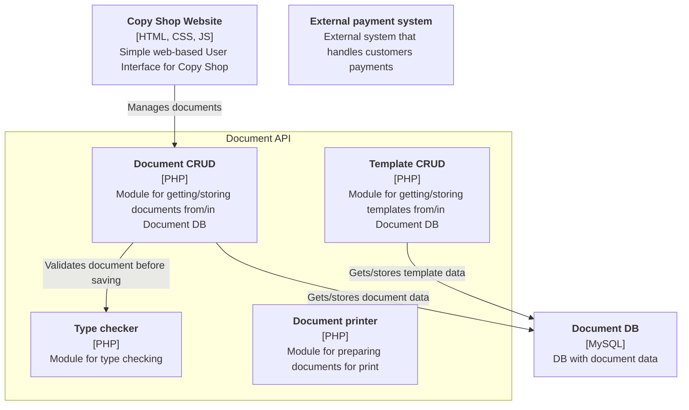

# Copy Shop
This document describes architecture design for Copy Shop.

Author: Jakub Sowiński

Status: In progress

Last updated: 03-06-2024

## Context
A local copy shop chain wants to offer its customers an 'all-in-one' computing experience: document creation, editing, storage, and printing.

- Users: initially, thousands in the local city, but potentially millions if the demand grows
- Requirements:
  - browser-based or delivered documents
  - word processing
  - presentations
  - document templates (as start points)
  - versioning
  - print scheduling
  - automatic and manual payment for storage, printing, etc.
- Additional Context:
  - main reason for this initiative is better customer engagement and loyalty
  - for historical reasons, operations is handled by another company and isn't very responsive

## Architectural drivers

### High-level functional requirements

#### Actors
Actors described below will be further referred to as (A1), (A2), (A3), etc.

| Name | Code | Description |
| --- | --- | --- |
| Customer | A1 | Copy shop customer, who can create, edit, store, and print documents. |
| Copy shop worker | A2 | Copy shop worker, who can accept or decline customers (A1) orders. |
| System admin | A3 | System administrator, who can add, edit, and remove copy shop workers (A2). |

#### Requirements

Requirements described below will be further referred to as (R1.1), (R1.3.2), (R2.1), etc.

##### Customer (A1)

As a Customer (A1), I want to be able to:

1. Authenticate and authorize
    1. Create an account (registration)
    2. Access my account (login)
    3. Manage my account
        1. Delete account
        2. Change password
        3. Request all my personal data
        4. Request to be forgotten
2. Manage documents
    1. Browse saved documents
        1. Display a list of saved documents
        2. Display a list of previous versions for each document
        3. Display selected document in selected version
    2. Create new document
        1. From scratch (empty)
        2. From template
            1. Browse existing templates
            2. Use selected template as a start point for new document
    3. Save document under selected name (without overwriting previous version)
    4. Edit document (with type checking)
    5. Delete document

##### Copy shop worker (A2)

As a Copy shop worker (A2), I want to be able to:

3. Authenticate and authorize
    1. Access my account (login)
4. Manage orders
    1. Accept or deny order
        1. Receive new order notification
        2. Select appropriate response
    2. Print accepted order
        1. Confirm printing start (all parameters are automatically provided based on order)
        2. Mark order as printed in system
    3. Send printed order
        1. Physically send order
        2. Mark order as sent in system
5. Manage templates
    1. Browse list of templates
    2. Create template (using document editor that is also used by users (A1))
    3. Edit existing template (using document editor that is also used by users (A1))
    4. Delete existing template

##### System admin (A3)

6. Authenticate and authorize
    1. Access my account (login)
7. Manage copy shop workers
    1. Browse list of copy shop workers
    2. Create new copy shop worker
        1. Create login and password
    3. Edit existing copy shop worker
    4. Delete existing copy shop worker

### Business limitations
Business limitations described below will be further referred to as (BL1), (BL2), (BL3), etc.

### Technical limitations
Technical limitations described below will be further referred to as (TL1), (TL2), (TL3), etc.

### Characteristics
Characteristics described below will be further referred to as (C1), (C2), (C3), etc.

## System (C1)

### System diagram
Systems included in this diagram will be further referred to as (S1), (S2), (S3), etc.

External systems included in this diagram will be further referred to as (E1), (E2), (E3), etc.

### Conceptual data model

## Containers (C2)

### Container diagram
Modules included in this diagram will be further referred to as (M1.1), (M1.2), (M1.3), etc.

Data stores included in this diagram will be further referred to as (DS1.1), (DS1.2), (DS1.3), etc.

## Components (C3)

### Component diagram

- TYPE CHECKING
- PRINT SCHEDULING

- Customer
    - id
    - login
    - password
    - address
    - documents
    - orders
    <!-- {
      uuid id
      string login
      string password
      string address
      
    } -->

- Document
    - id
    - versions

- DocumentVersion
    - id
    - content
    - timestamp

- Order
    - id
    - documentversion
    - status